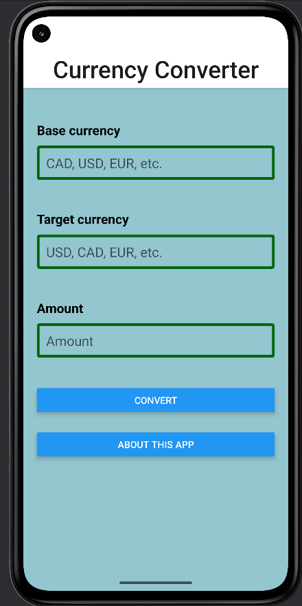
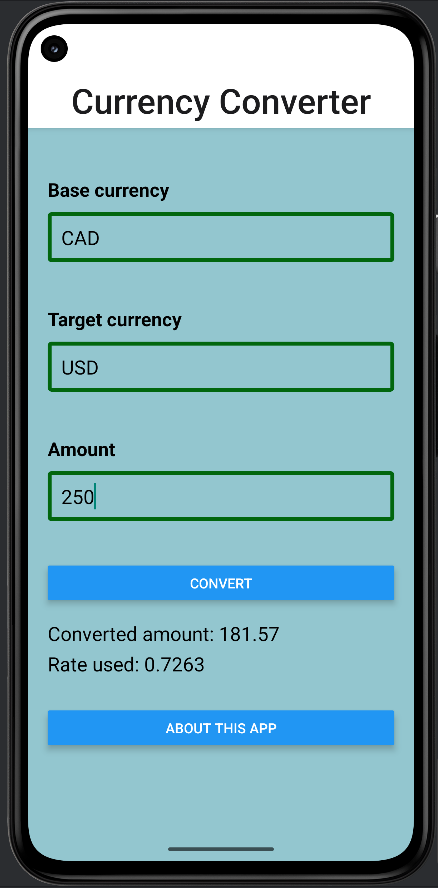

# Currency Converter App

A mobile application built with React Native that allows users to convert amounts between different currencies using live exchange rates.

# Features of the App
* Convert an amount between two currencies.
* Input validation for currency code and amount.
* Error handling for invalid or missing input.
* Uses live exchange rates from FreeCurrencyAPI.
* Clean UI with multiple screens.
* Navigation between Main and About screens.

# Screen Included
* Main Screen - for entering amounts and converting.
* About screen - displays information about the application.

## Screenshots 

### Main Screen

### Conversion Result 

### About Screen

# Tech Stack
- React Native 
- Expo
- TypeScript / JavaScript
- React Navigation
- Fetch API

# Getting Started
1. Clone the repository
2. Run `npm install`
3. Add your FreeCurrencyAPI key in the constants file (API key placeholder provided)
4. Run `npm start` or `npx react-native run-android`

# API Requirement
Register for a free API key here: 
https://freecurrencyapi.com 

## Notes
This project was initially created as a learning exercise and later refined for portfolio presentation. 

## Author 
Developed by **Ebrahim Al-Serri**
Computer Programming & Analysis - George Brown College

